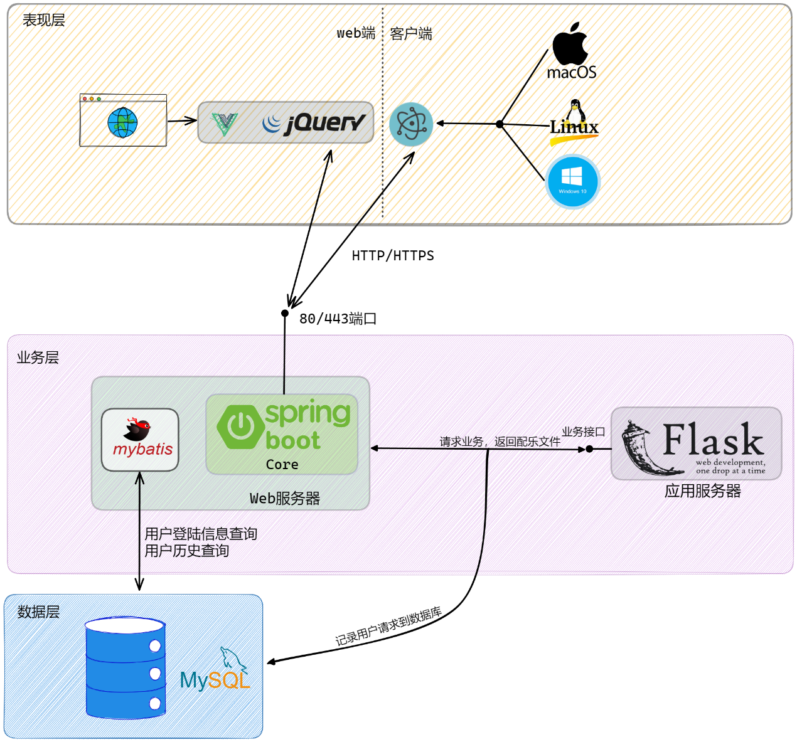

### 项目简介

学校作业

利用隐马尔可夫模型和维特比解码AI生成旋律，效果很垃圾。python部分有bug，hmm的代码有问题，懒得改了。

提供web端和Electron的客户端，web端由springboot提供，hmm部署在flask中。

### 项目架构

想进一步了解请看`概要设计文档.docx`

### 使用到的项目

https://github.com/nativefier/nativefier